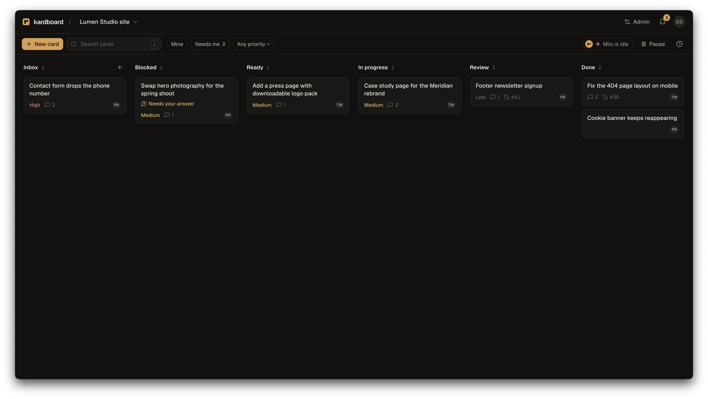
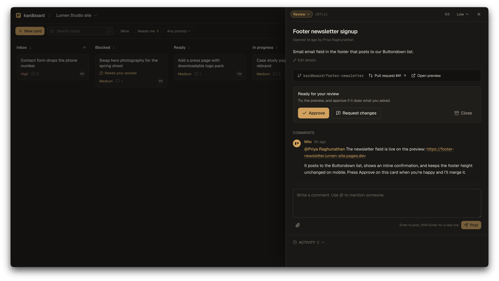

<div align="center">

<picture>
  <source media="(prefers-color-scheme: dark)" srcset="docs/brand/kardboard-wordmark-on-dark.svg">
  
</picture>

**A self-hosted kanban board where every card change summons a coding agent.**

</div>

<br>



## What it does

The app runs at [kardboard.cc](https://kardboard.cc). [Domain configuration](docs/runbooks/domains.md) covers sign-in, email, and Card preview hostnames.

kardboard is a kanban board for one project per board. Your clients, teammates, or you write cards. About a minute after a card is created, edited, commented on, or moved, kardboard starts a **Session**: a disposable container running Claude Code (or Codex) that clones the project, reads the board over MCP, and either does the work or asks a clarifying question on the card.

When the work is done, the Session opens a pull request and moves the card to Review. A member presses **Approve**, and kardboard merges the pull request, moves the card to Done, and lets everyone know. Sessions can push branches but can never merge; that authority stays with kardboard.



## Features

- **Six fixed columns** with clear meanings: Inbox, Blocked, Ready, In Progress, Review, Done.
- **Cards** with Markdown descriptions, priority, comments, `@mentions`, and file attachments you can pick, paste, or drop, including on a new card. Search and filters, and a Done column that folds its older cards.
- **Clear waiting states**: a card says when the agent will pick it up, pins the agent's question when it is blocked on you, and tells you in plain words when a run failed, with **Try again**.
- **One agent identity** across all boards, with a configurable name and avatar (the default is Milo).
- **Per-board settings** for the repository, provider, model, reasoning level, preview mode, member access, and extra instructions.
- **Sessions that see the whole board**: an MCP server exposes the ledger of active Sessions, every card, comments, and attachments, plus tools to comment, move, and create cards.
- **Safe by construction**: Sessions run with resource limits, a wall clock, a one-hour repository token, and no access to your provider credentials, which stay in a proxy.
- **Approvals bound to code**: an Approval records the pull request commit the reviewer saw. A later push voids it, failing CI blocks it, and kardboard notices pull requests merged, closed, or pushed to on GitHub.
- **Previews per card**: in runner preview mode kardboard builds the branch's Dockerfile and hosts it at the card's own hostname, open only to that board's members through a single-use code and a host-only cookie, and taken down when the card reaches Done.
- **Provider fallback**: when a subscription runs out of usage, the proxy sees the refusal and the card is picked up again on the other provider.
- **Notifications** for mentions, failed runs, and the card moves that need you: a bell with an unread badge in the app, and email through Resend that each person can turn down or off.
- **Invite-only access** with Clerk. Only email addresses you add can sign in, each member only sees their boards, and an invitation email tells them where to do it.
- **Live session transcripts**: expand any run in the admin panel to watch the agent's messages, tool calls, and results arrive as they happen.
- **Live updates** over server-sent events, verified nightly database snapshots with an optional off-disk copy, and an admin panel for users, boards, the agent, sessions with their token use and cost, and backups. The admin is emailed when backups, the runner, or a provider credential need attention.

## How a Session works

1. A human change to a card is a **Trigger**. Triggers on the same card within a minute are batched. When more cards are waiting than there are free session slots, the next one is taken by priority, then board order, then age.
2. kardboard claims the card and asks the **runner** to start a container from the agent image.
3. The container clones the repository on a branch named after the card and starts the provider CLI with a workflow prompt and the kardboard MCP server.
4. The Session orients, classifies the request, implements it, runs the repository's acceptance command from `AGENTS.md`, pushes, and opens a pull request.
5. It reports with one comment and moves the card to Review. Unclear requests go to Blocked with a question instead.
6. On Approve, kardboard squash-merges through a second GitHub App that bypasses the branch ruleset, deletes the branch, and moves the card to Done.

A request too large for one pull request is split into child cards instead. Each child starts its own session as soon as it is created, the parent waits in Blocked, and it wakes by itself once every child reaches Done — told which of them were merged and which were closed without an implementation. Nothing else the agent does starts a session: a card it creates for a person to act on has no parent and waits in Ready for them.

## Architecture

| Service | Role |
| --- | --- |
| `packages/app` | Web app, REST API, MCP server, orchestrator. SQLite via Drizzle. Vite + React client. |
| `packages/runner` | The only service with the Docker socket. Starts and stops Session containers and keeps their logs. |
| `packages/egress` | Proxy that injects the provider credential, so containers never hold it. |
| `packages/preview-router` | Routes runner-hosted previews by hostname behind a signed cookie. |
| `images/agent` | The default Session image: Node, Bun, Python, Go, git, gh, Claude Code, Codex. |
| `packages/shared` | Types and schemas shared by server and client. |

Vocabulary is defined in [CONTEXT.md](CONTEXT.md). Design decisions with trade-offs live in [docs/adr](docs/adr/), and the full design in [docs/design.md](docs/design.md).

## Getting started

Requires Node 24+ and pnpm 11.

```bash
pnpm install
pnpm dev
```

Open http://localhost:5173. With no `.env` present, authentication runs in **dev mode**, which is refused in production: every request is the seeded admin, and a demo board with cards and comments is created on first start. Sessions are recorded but nothing runs until a runner is configured.

Other commands:

```bash
pnpm typecheck   # every package
pnpm test        # every package
pnpm build       # client bundle and server output
pnpm db:generate # a new migration after editing the schema
```

## Configuration

Copy `packages/app/.env.example` to `packages/app/.env`. The variables that matter most:

| Variable | Purpose |
| --- | --- |
| `KARDBOARD_PUBLIC_URL`, `KARDBOARD_REDIRECT_HOSTS` | Canonical app URL and comma-separated old hosts that redirect to it. |
| `KARDBOARD_AUTH` | `clerk`, or `dev` for local work. Dev mode signs every request in as the seeded admin, so with `NODE_ENV=production` the app refuses to start unless this is `clerk`; the one exception is a Preview container, which the runner marks with `KARDBOARD_PREVIEW_HOST`. |
| `CLERK_SECRET_KEY`, `VITE_CLERK_PUBLISHABLE_KEY` | Clerk credentials for `clerk` mode. |
| `KARDBOARD_ADMIN_EMAIL` | The first admin, created on first start. |
| `RESEND_API_KEY`, `KARDBOARD_EMAIL_FROM` | Email delivery. Without a key, emails are logged instead of sent. |
| `KARDBOARD_RUNNER_URL`, `KARDBOARD_RUNNER_TOKEN` | Where the runner is and the shared secret between app and runner. |
| `GITHUB_SESSIONS_APP_*`, `GITHUB_MERGE_APP_*` | The two GitHub Apps. See [deploy/github-apps.md](deploy/github-apps.md). |
| `CLAUDE_CODE_OAUTH_TOKEN` | Held by the egress proxy only. Create it with `claude setup-token`. |
| `KARDBOARD_BACKUP_HOUR`, `KARDBOARD_BACKUP_KEEP` | Daily snapshot hour and how many to keep. |
| `KARDBOARD_BACKUP_COPY_DIR` | Optional off-disk copy of every snapshot and attachment, such as a NAS share. The directory needs a `.kardboard-backup-target` marker file. |
| `KARDBOARD_PREVIEW_SECRET`, `KARDBOARD_PREVIEW_HOST_PATTERN` | Signs preview cookies, and the preview hostname shape. Needed only for boards in `runner` preview mode. |

## Deploying

kardboard ships as five Docker images built by the included GitHub Actions workflow. [`deploy/compose.yaml`](deploy/compose.yaml) runs the four services on any Docker host, with separate networks so Session containers can reach the app and the credential proxy but never the runner or each other: the runner gives every Session a bridge of its own. Keeping Sessions and previews off your LAN as well is a host firewall rule the compose file cannot carry — run [`deploy/network-isolation.sh`](deploy/network-isolation.sh), described in [the network isolation runbook](docs/runbooks/network-isolation.md). Put the public hostname in front of the app's port with whatever reverse proxy or tunnel you already use.

External services you need to set up once:

- A **Clerk** application for sign-in.
- A **Resend** domain for email.
- Two **GitHub Apps**, one for Sessions and one for merges, installed on each project repository, plus a branch ruleset that requires an approved pull request. [deploy/github-apps.md](deploy/github-apps.md) walks through it.

## Onboarding a repository

Runner-hosted previews require a root `Dockerfile` that listens on `$PORT`. This repository's root `Dockerfile` links to `packages/app/Dockerfile`, so previews build the branch's app with a separate, seeded database and no production credentials. Access is checked by the preview router before requests reach that app. See [the preview runbook](docs/runbooks/previews.md) for DNS, certificates, and host configuration.

Each board points at one repository. To prepare one, run the `kardboard-onboard` skill from [chriscorbell/skills](https://github.com/chriscorbell/skills) in that repository with your coding agent, or follow the same steps by hand: give `AGENTS.md` a verified acceptance command, install both GitHub Apps, create the `kardboard` ruleset, and add the board in the admin panel.

> [!NOTE]
> kardboard is itself a board on kardboard. Some of its own changes arrive as pull requests from Milo.

## Status

The full loop runs in production: sign-in, card to Session, pull request, Approval, merge, deploy. Runner-hosted previews are configured on minicore with `{card}.kardboard.cc` URLs; [the preview runbook](docs/runbooks/previews.md) records setup and verification limits. See [docs/design.md](docs/design.md) for the current status and [docs/runbooks](docs/runbooks/) for operations.
