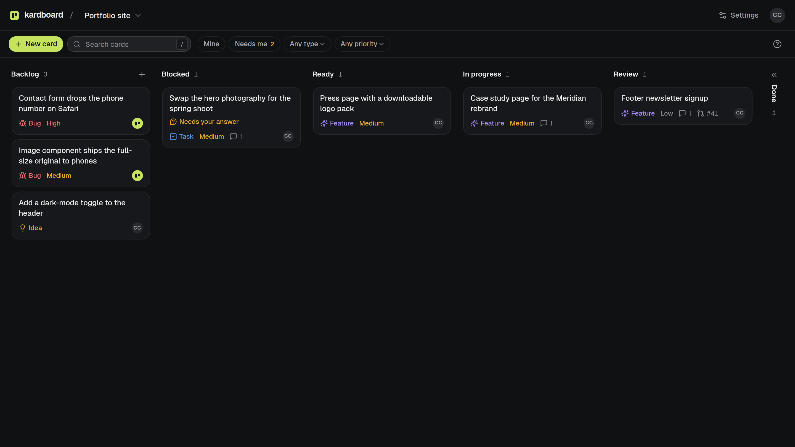
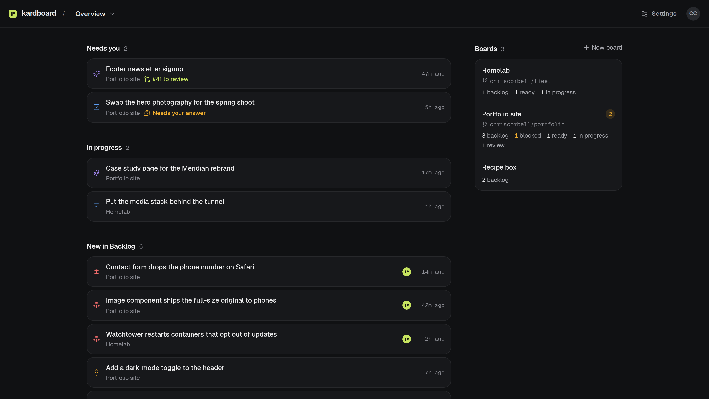
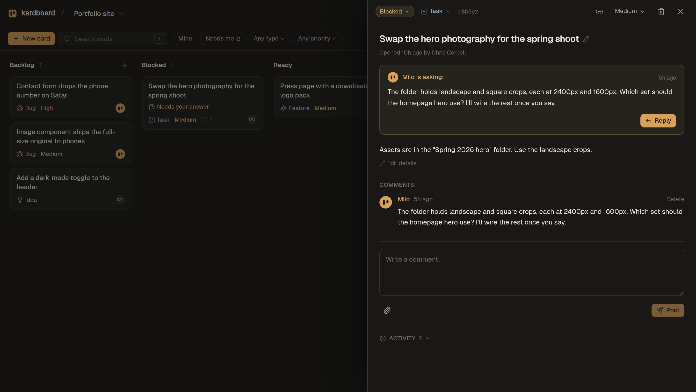

<div align="center">

<picture>
  <source media="(prefers-color-scheme: dark)" srcset="docs/brand/kardboard-wordmark-on-dark.svg">
  
</picture>

**A self-hosted kanban board for all your projects, kept by you and your coding agents, on your tailnet.**

</div>

<br>



## What it does

**kardboard** keeps every project you work on as a board of cards, and lets your coding agents keep them up to date. You and your agent track features, bugs, and chores in one place instead of across chat threads, and when an agent notices something outside the task at hand, it files a card for later instead of leaving it buried in a reply.

Nothing on a board starts on its own. You decide which agent works on what, and when, in the agent you are already talking to. The agent reads and changes boards through kardboard's MCP server: it moves a card to In Progress when it starts, asks its question on the card and moves it to Blocked when it needs you, records the pull request and moves the card to Review, and closes it in Done once it has merged it.

The home page is an Overview of every board: what needs you, what's in progress, and what landed in Backlog lately.





## Features

- **Six fixed columns** with clear meanings: Backlog, Blocked, Ready, In Progress, Review, Done.
- **Card types**: every card is a bug, feature, task, idea, or chore, each with its own color and icon, so a board sorts itself at a glance.
- **Cards** with Markdown descriptions, priority, comments, and file attachments you can pick, paste, or drop, including on a new card. Search and filters, and a Done column that stays a narrow strip until you open it, and then folds its older cards.
- **An Overview of every board**: what needs you, what's in progress, and what landed in Backlog lately, across all your projects, on the home page.
- **Questions you can see**: a card in Blocked pins the agent's question and says it needs your answer, and the agent sees which cards you have answered since it last looked.
- **One agent identity** across all boards, with a configurable name and avatar (the default is Agent), so the board always tells your words from your agents'.
- **An MCP server for your own agents**: one token reaches every board; an agent finds the board for its repository from the git remote, creates one for a new project when you say so, files side-findings in Backlog, and every change it makes is checked against the revision it last read.
- **Live updates** over server-sent events, verified nightly database snapshots with an optional off-disk copy, and a warning on the Overview when a backup fails.

## Architecture

| Package | Role |
| --- | --- |
| `packages/app` | Web app, REST API, and MCP server. SQLite via Drizzle. Vite + React client. |
| `packages/shared` | Types and schemas shared by server and client. |

## Getting started

Requires Node 24+ and pnpm 11.

```bash
pnpm install
pnpm dev
```

Open http://localhost:5173. Outside production, a data directory with no boards gets a few demo boards with cards and comments on first start.

Other commands:

```bash
pnpm typecheck   # every package
pnpm test        # every package
pnpm build       # client bundle and server output
pnpm db:generate # a new migration after editing the schema
```

## Configuration

Copy `packages/app/.env.example` to `packages/app/.env`. The variables that matter most:

| Variable | Purpose |
| --- | --- |
| `KARDBOARD_BACKUP_HOUR`, `KARDBOARD_BACKUP_KEEP` | Daily snapshot hour and how many to keep. |
| `KARDBOARD_BACKUP_COPY_DIR` | Optional off-disk copy of every snapshot and attachment, such as a NAS share. The directory needs a `.kardboard-backup-target` marker file. |

## Deploying

kardboard is one Docker image, built by the included GitHub Actions workflow. [`deploy/compose.yaml`](deploy/compose.yaml) runs it on any Docker host, with its data on a bind mount, on port 3071 of the host's loopback. Give it HTTPS on your [Tailscale](https://tailscale.com) tailnet with Tailscale Serve on that host:

```bash
sudo tailscale serve --bg --https=3071 http://127.0.0.1:3071
```

That serves it at `https://<host>.<tailnet>.ts.net:3071` with your tailnet's certificate, once HTTPS Certificates is on in the tailnet's DNS settings. kardboard has no sign-in: everyone on your tailnet is you, so never put it on the public internet. The first time you open it, it asks your name, which signs your cards and comments. [The access runbook](docs/runbooks/access.md) describes how it runs here.

## Connecting your agents

One access token connects a coding agent to every board. Install it once per machine, and the agent has kardboard in every project.

1. In **Settings → Agent**, under **Connect an agent**, name a token after where it will run and create it. The token is shown once.
2. Install it in your agent.

   Claude Code, once, from anywhere:

   ```bash
   claude mcp add --scope user --transport http kardboard https://your-host.your-tailnet.ts.net:3071/mcp --header "Authorization: Bearer kbat_..."
   ```

   So it doesn't ask before every board action, add `mcp__kardboard` to `permissions.allow` in `~/.claude/settings.json`.

   Codex reads the token from an environment variable. Export it from your shell profile, then add the server:

   ```bash
   export KARDBOARD_TOKEN=kbat_...
   codex mcp add kardboard --url https://your-host.your-tailnet.ts.net:3071/mcp --bearer-token-env-var KARDBOARD_TOKEN
   ```

3. Ask your agent what's on the board. It finds the board for the repository it is working in from `git remote get-url origin`, and when there is none it asks whether to create one, so onboarding a project is a single question. It moves cards as the work goes: In Progress when it starts, Blocked with a question when it needs you, Review once the pull request is open, and Done once it has merged it. When it notices something outside the task at hand, it files a card in Backlog and tells you in one line.

Revoke a token from the same place. kardboard never reads or merges pull requests, so a repository needs nothing from kardboard, and your agent merges with your own credentials.
